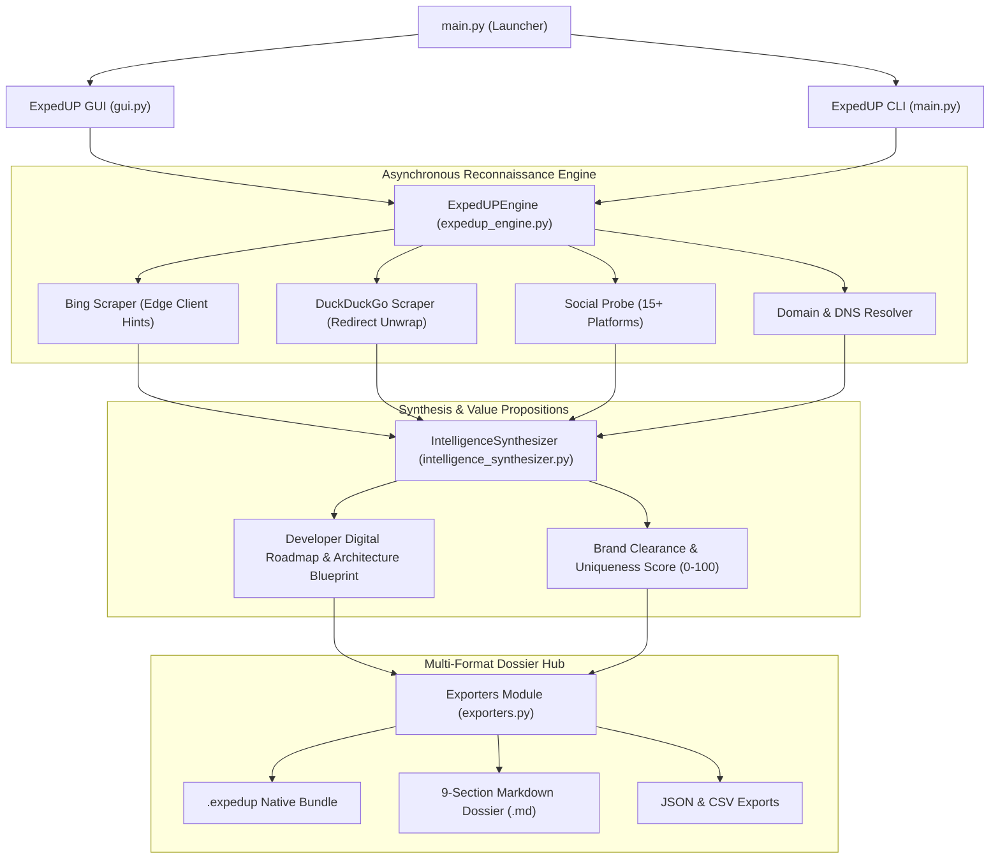
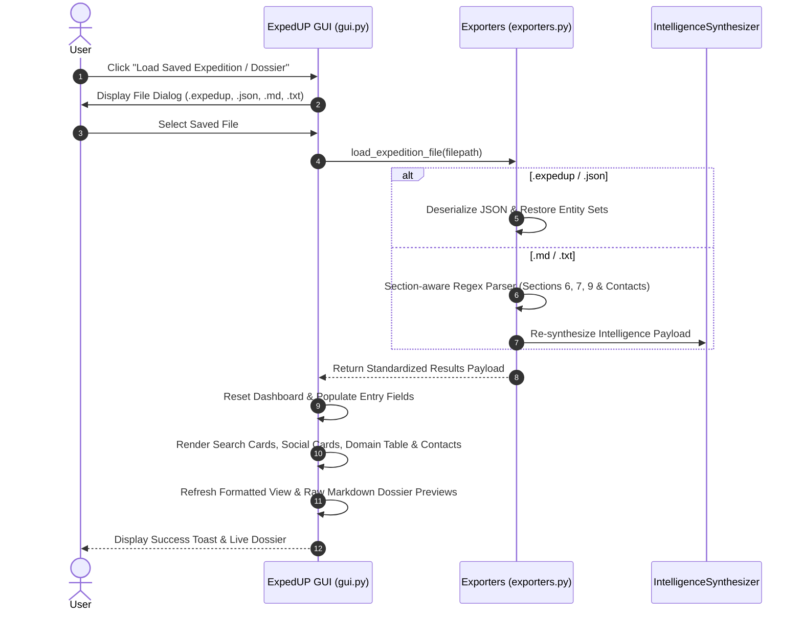

# ExpedUP System Architecture

ExpedUP is a desktop application and command-line engine built for deep OSINT (Open Source Intelligence), brand clearance audits, and digital presence synthesis.

---

## High-Level System Architecture Diagram

---

## Saved Expedition Loading Flow

---

## Core Modules & Responsibilities

### 1. `main.py`
Entry point for the application. Evaluates command line flags (`--cli`, `--target`, `--depth`, `--strict`, `--export-all`). Launches either the CustomTkinter GUI dashboard or the headless CLI pipeline.

### 2. `gui.py`
Modern CustomTkinter desktop interface adhering to Vectihost & Selligine design principles:
- **Left Sidebar**: Target input fields, depth selection, Strict Go By Keyword switch, execution controls, progress indicator, and Export Hub.
- **Main Tabview**: Executive Overview, Web Search Results, Social Media Presence, Domain Availability, Contact Entities, Engine Settings, and Console Log.
- **Network Struggle Modal**: Interactive connection manager dialog that monitors WAN connectivity and handles connection pauses/resumes.
- **Two-Box Dossier Preview**: Toggle between Formatted Section View and Raw Markdown syntax.
- **Saved Dossier Loader**: Re-loads saved `.expedup`, `.json`, `.md`, and `.txt` files into the UI.

### 3. `expedup_engine.py`
Asynchronous multi-threaded reconnaissance engine:
- **Bing & DuckDuckGo Scraping**: Uses modern Edge Client Hints (`Sec-Ch-Ua`, `Sec-Fetch-*`) to bypass anti-bot challenges and extract structured search titles, canonical URLs, and snippets.
- **URL Unwrapping**: Resolves tracking redirects (e.g. Bing `&u=a1...`) into direct URLs.
- **Social Media Probing**: Audits handles across 15+ platforms (Instagram, Threads, TikTok, Facebook, Twitter/X, LinkedIn, GitHub, YouTube, Reddit, Telegram, etc.) with platform-specific generic title filtering.
- **Domain & DNS Resolution**: Probes standard TLDs (`.com`, `.net`, `.org`, `.co`, `.io`, `.app`, `.dev`, `.ai`, `.gh`, `.ng`, `.uk`, etc.) via socket IP lookup and HTTP status probes.
- **Adaptive Regional Pivot**: Automatically detects regional location anchors from initial search hits (e.g. `#Takoradi`, `#Accra`) and spawns localized secondary queries.
- **Network Failure Manager**: Monitors consecutive request timeouts and socket health, triggering auto-pause when offline.

### 4. `intelligence_synthesizer.py`
Synthesizes raw OSINT findings into actionable intelligence:
- **Developer Digital Roadmap & Architectural Blueprint**: Identifies operating base, mobility model, service lines, manual bottlenecks, recommended platform modules, and database schema entities.
- **Brand Clearance & Name Collision Matrix**: Computes a 0–100 Uniqueness Score, categorizes handle availability across platforms, and generates recommended collision-free brand variations.

### 5. `exporters.py`
Export engine supporting multiple dossier formats:
- **Publication-Grade Markdown Exporter**: Generates a 9-section report.
- **ExpedUP Bundle Exporter (`.expedup`)**: Creates portable JSON bundles containing raw findings and synthesized intelligence.
- **JSON & CSV Exporters**: Structured data exports for automated pipelines.
- **Universal Importer (`load_expedition_file`)**: Loads `.expedup`, `.json`, `.md`, and `.txt` dossiers back into standard dictionary structures.

### 6. `settings_manager.py`
Handles persistence of user settings (`settings.json`):
- Controls theme mode (`Light` / `Dark`), recon depth default, typography scale factor (`100%`, `110%`, `120%`), export directory, HTTP timeouts, and probe delay ranges.
- Enforces non-instant staged execution: settings are only applied when the user clicks `"Save & Apply Settings"`.
